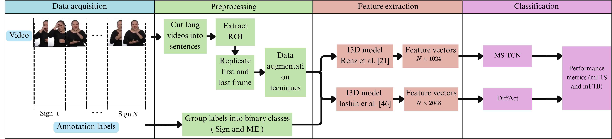

# Temporal-segmentation-for-Peruvian-Sign-language-
This repository provides code for Temporal Video Segmentation Approach for Peruvian Sign language paper. It contains all the necessary files related to the implementation of the system designed to segment, in the time domain, sentences in Peruvian Sign Language (LSP) into smaller portions of sign language 

# 📝 Introduction
This repository provides the codebase and associated resources for our research on temporal video segmentation in Peruvian Sign Language (LSP). The system is designed to automatically segment continuous LSP video sequences into smaller, meaningful sign units, facilitating tasks such as annotation, recognition, and linguistic analysis.

Our approach leverages deep learning techniques to perform segmentation in the temporal domain, addressing the unique challenges posed by sign language, such as coarticulation and visual variability in sign execution. We used two ML models: MS-TCN and Diffact, then evaluated their performance over our own dataset.



# Table of Contents
1. [Repository Structure](#repository-structure)
2. [Requirements](#requirements)
3. [Installation](#installation)
4. [Collaboration](#collaboration)
5. [FAQs](#faqs)

# 📁 Repository Structure

```bash

├── Dataset
│   ├── 305_PUCP
|   |   ├── annotations
|   |   ├── features
|   |   ├── groundTruth
|   |   ├── splits
│   ├── ira_alegria  
|   |   ├── annotations
|   |   ├── . . .
│   ├── manejar_conflictos
|   |   ├── annotations
|   |   ├── . . .  
│   ├── joined_splits   
│   ├── test_data 
├── MS-TCN
│   ├── files
│   ├── results
│   └── models  
├── Diffact
│   ├── files
│   ├── results
│   └── models
├── preprocessing
├── README.md
└── LICENSE
```

# ⚙️ Requirements

To use this repository you should already have installed miniconda and have configured your gpu. The packcages needed to run the code are listed on the `requeriments.txt` file.

# 📊 Data and models

## Data

We provide the preextracted features () and the groundTruth labels for the datasets `manejar_conflictos`, `ira_alegria` and `305_PUCP`. The original videos can be found in the following links [ira_alegria_video](https://youtu.be/JB_HmR2lvuI),  [manejar_conflictos_video](https://youtu.be/TABP3tC1I50) and [305_PUCP](https://datos.pucp.edu.pe/dataset.xhtml?persistentId=hdl:20.500.12534/JU4OLG).

You can also extract features from other videos, cloning the repository from [video_features](https://github.com/v-iashin/video_features) or executing the file `extract_features.py`from the `Feature_extraction` folder, for Diffact. The file for MS-TCN includes the feature extraction phase. 

The statistict for the three datasets are shown in the following table:

| Datasets | # Sentences| Annotated time| Mean sentence duration (s)| # Signers |
| - | - | - | - | - |
|`manejar_conflictos`| 171 | 21.17 | 8.36s | 1 |
| `ira_alegria_RE` | 201 | 20.97 | 9.82 | 1 |
| `PUCP-305_RE`| 174 | 15.50 | 5.80 | 5 |


## Models
The pretrained models are included in the models folder for MS-TCN and Diffact.


# Setup

```bash
# Clone this repository

git clone https://github.com/Roml68/Temporal-segmentation-for-Peruvian-Sign-language.git

# Go to the main directory

cd Temporal-segmentation-for-Peruvian-Sign-language

# Create the three virtual enviroment needed for Diffact, Feature_extraction and Preprocessing

cd <folder>
conda create --name <env_name>--file requeriments.txt
conda activate <env_name>


```


### Usage

```bash
# Diffact -> run the following command to perform inference over a given video

python3 main.py --config configs/some_config.json --device gpu_id

# MS-TCN ->
```

# Acknowledgment

The code builds on the [sign-segmentation](https://github.com/RenzKa/sign-segmentation), [video_features](https://github.com/v-iashin/video_features) and [Diffact ](https://github.com/Finspire13/DiffAct) repositories

# Citation

```bash

```
# Licence

MIT

